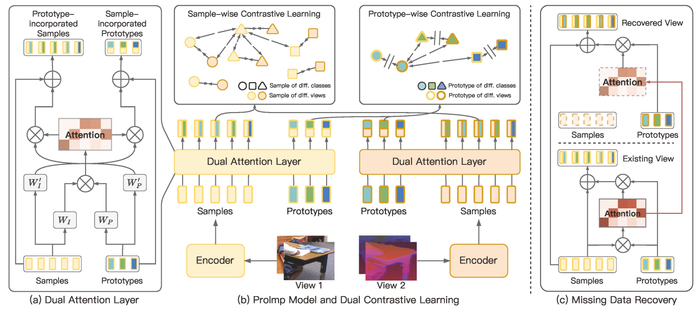

# Incomplete Multi-view Clustering via Prototype-based Imputation (IJCAI2023)


This repo contains the code and data of our IJCAI'2023 paper Incomplete Multi-view Clustering via Prototype-based Imputation. 

> [Incomplete Multi-view Clustering via Prototype-based Imputation](http://pengxi.me/wp-content/uploads/2023/07/Incomplete-Multi-view-Clustering-via-Prototype-based-Imputation.pdf)



## Requirements

pytorch>=1.2.0 

numpy>=1.19.1

scikit-learn>=0.23.2

munkres>=1.1.4

## Configuration

The hyper-parameters, the training options (including **the missing rate**) are defined in configure.py.

## Datasets

The Scene-15, CUB datasets are placed in "data" folder. 

## Usage

The code includes:

- an example implementation of the model,
- an example clustering task for different missing rates.

```bash
python run.py --dataset 0 --devices 0 --print_num 50 --test_time 5
```

You can get the following output:

```bash
- Epoch : 50/150 ===> Learing Rate = 0.0010===> Ins loss = 1.6216e+01 ===> Clu loss = 0.0000e+00 ===> Loss = 1.6216e+01
-0.014516947
view_concat {'kmeans': {'AMI': 0.4169, 'NMI': 0.4217, 'ARI': 0.2382, 'accuracy': 0.3998, 'precision': 0.39, 'recall': 0.4057, 'f_measure': 0.3856}}
- Epoch : 100/150 ===> Learing Rate = 0.0010===> Ins loss = 1.5952e+01 ===> Clu loss = 8.9596e+00 ===> Loss = 2.4912e+01
-0.0060014944
- view_concat {'kmeans': {'AMI': 0.4248, 'NMI': 0.4295, 'ARI': 0.2565, 'accuracy': 0.4261, 'precision': 0.4072, 'recall': 0.428, 'f_measure': 0.407}}
- Epoch : 150/150 ===> Learing Rate = 0.0010===> Ins loss = 1.5866e+01 ===> Clu loss = 8.9524e+00 ===> Loss = 2.4818e+01
0.0018155271
- view_concat {'kmeans': {'AMI': 0.4321, 'NMI': 0.4368, 'ARI': 0.2705, 'accuracy': 0.443, 'precision': 0.4272, 'recall': 0.4439, 'f_measure': 0.4235}}
```
## Reference

If you find our work useful in your research, please consider citing:

```latex
@article{li2023incomplete,
  title={Incomplete Multi-view Clustering via Prototype-based Imputation},
  author={Li, Haobin and Li, Yunfan and Yang, Mouxing and Hu, Peng and Peng, Dezhong and Peng, Xi},
  booktitle={Proceedings of the 32th International Joint Conference on Artificial Intelligence},
  year={2023}
}
```

